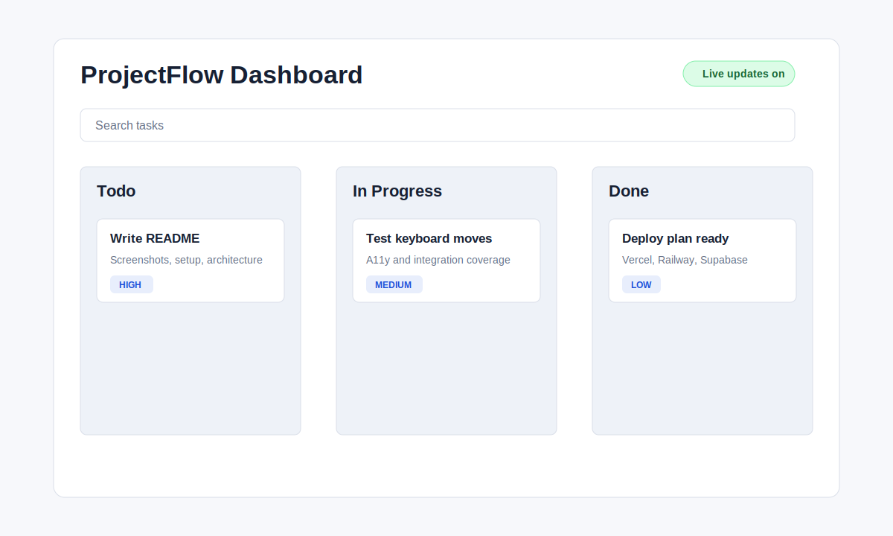
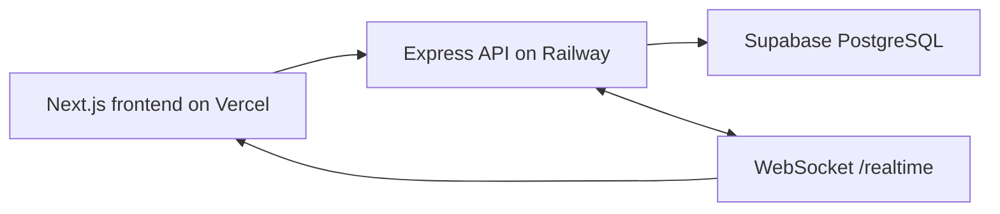

# ProjectFlow Dashboard

Day 30 capstone polish: a simple project management dashboard with auth, projects, a Kanban board, task details, comments, real-time board refreshes, loading skeletons, empty/error states, keyboard accessibility, tests, and deployment notes.



## Exact Setup Commands

```bash
# From scratch
mkdir Day30
cd Day30
npm init -y

# If you already have this completed folder, run:
npm install
npm run db:generate
npm run db:migrate
npm run db:seed
npm run dev
```

Open:
- Frontend: http://localhost:3000
- Backend health check: http://localhost:4000/health

Use the seeded demo account if you ran the seed script:
- Email: `demo@example.com`
- Password: `password123`

## Do We Need Frontend Only?

No. This assignment needs both frontend and backend.

- Frontend: Next.js app on Vercel.
- Backend: Express API on Railway.
- Database: PostgreSQL on Supabase.
- Real-time updates: WebSocket endpoint on the backend at `/realtime`.

The frontend cannot do real-time multi-user updates by itself because every user needs a shared source of truth. The backend saves the task move, broadcasts a board update event, and every connected browser refreshes the board.

## File Tree

```text
Day30/
  apps/
    api/
      prisma/
        migrations/
        schema.prisma
        seed.ts
      src/
        lib/
          asyncHandler.ts
          auth.ts
          prisma.ts
          realtime.ts
        middleware/
          errorHandler.ts
          requireAuth.ts
        routes/
          auth.ts
          boards.ts
          projects.ts
          tasks.ts
        index.ts
      .env.example
      package.json
      tsconfig.json
    web/
      public/
        screenshot-dashboard.svg
      src/
        app/
          board/[projectId]/page.tsx
          projects/page.tsx
          globals.css
          layout.tsx
          page.tsx
        components/
          AppHeader.tsx
          AuthForm.tsx
          BoardColumn.tsx
          CreateProjectForm.tsx
          PageShell.tsx
          ProjectCard.tsx
          Providers.tsx
          StatusViews.tsx
          TaskCard.tsx
          TaskModal.tsx
        hooks/
          useBoardRealtime.ts
        lib/
          api.ts
          boardUtils.ts
          types.ts
        store/
          useAuthStore.ts
        test/
          Component.test.tsx
          Integration.test.ts
          setup.ts
          testData.ts
      .env.example
      package.json
      tsconfig.json
      vitest.config.ts
  docker-compose.yml
  package.json
  README.md
```

## Tech Stack

- React and Next.js: frontend UI, routing, SEO metadata.
- TypeScript: safer data shapes across frontend and backend.
- TanStack Query: server-state cache and refetching.
- Zustand: tiny auth store.
- dnd-kit: accessible drag-and-drop foundation.
- Framer Motion: page, card, modal, skeleton, and layout animations.
- Express: beginner-friendly backend API.
- Prisma: typed database access.
- PostgreSQL: production database on Supabase.
- WebSocket: simple real-time board update broadcasts.
- Vitest and Testing Library: component and integration tests.

## Architecture



## Run Locally

1. Copy environment files:

```bash
copy apps\api\.env.example apps\api\.env
copy apps\web\.env.example apps\web\.env.local
```

2. Start PostgreSQL with Docker:

```bash
docker compose up -d
```

3. Prepare the database:

```bash
npm install
npm run db:generate
npm run db:migrate
npm run db:seed
```

4. Run the full app:

```bash
npm run dev
```

## Tests

```bash
npm run test
npm run build
```

Current coverage:
- 11 component tests.
- 7 integration-style tests.
- Build verifies both API TypeScript and the Next.js production bundle.

## Deployment

### 1. Supabase Database

1. Create a Supabase project.
2. Open Project Settings, Database, Connection string.
3. Copy the pooled PostgreSQL URL.
4. Use that URL as `DATABASE_URL` in Railway.

### 2. Railway Backend

1. Push this folder to GitHub.
2. Create a Railway project from the repo.
3. Set the root directory to `apps/api`.
4. Add environment variables:

```text
DATABASE_URL=your_supabase_postgres_url
JWT_SECRET=use_a_long_random_secret
WEB_ORIGIN=https://your-vercel-app.vercel.app
PORT=4000
```

5. Build command:

```bash
npm install && npm run db:generate && npm run build --workspace apps/api
```

6. Start command:

```bash
npm run start --workspace apps/api
```

7. Run migrations from your machine:

```bash
set DATABASE_URL=your_supabase_postgres_url
npm run db:migrate
```

### 3. Vercel Frontend

1. Import the same GitHub repo in Vercel.
2. Set the root directory to `apps/web`.
3. Add environment variable:

```text
NEXT_PUBLIC_API_URL=https://your-railway-api.up.railway.app
```

4. Deploy. The WebSocket URL is created automatically by changing `https` to `wss`.

## Demo Video Plan

Record a 2-minute video with this flow:

1. Show login and project list.
2. Create a project and open its board.
3. Add a task, drag it, then use ArrowRight/ArrowLeft to move it by keyboard.
4. Open the same board in another browser window and show the real-time refresh.
5. Open task details, edit priority/date, and add a comment.
6. Show tests passing with `npm run test`.
7. End on the README architecture diagram and deployment links.

## Interview Prep

- Why Next.js: routing, metadata, and deploy-friendly React.
- Why Express: small API surface that is easy to explain.
- Why Prisma: typed models and safer database queries.
- Why WebSocket: instant board refresh without waiting for polling.
- Trade-off: this broadcasts board refresh events, not full collaborative conflict resolution.
- What I would improve: add team membership, per-project permissions, optimistic ordering, file attachments, audit logs, and end-to-end tests.
